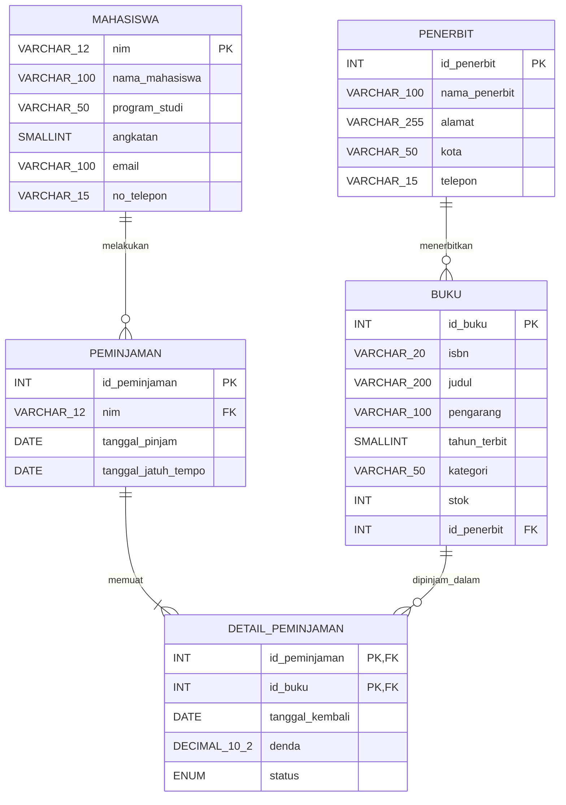

# Tugas Mandiri: Perancangan ERD E-Library Kampus

| | |
|---|---|
| **Nama** | Muhammad Fadhil Razak |
| **NIM** | D121241060 |
| **Universitas** | Universitas Hasanuddin |

## 1. Skenario

Merancang basis data relasional untuk sistem peminjaman buku perpustakaan kampus. Sistem mencatat data mahasiswa, buku, penerbit, serta riwayat peminjaman dan pengembalian.

## 2. Entitas, Atribut, dan Kunci

| Entitas | Atribut | Primary Key | Foreign Key |
|---|---|---|---|
| Mahasiswa | nim, nama_mahasiswa, program_studi, angkatan, email, no_telepon | nim | - |
| Penerbit | id_penerbit, nama_penerbit, alamat, kota, telepon | id_penerbit | - |
| Buku | id_buku, isbn, judul, pengarang, tahun_terbit, kategori, stok, id_penerbit | id_buku | id_penerbit → Penerbit |
| Peminjaman (Transaksi) | id_peminjaman, nim, tanggal_pinjam, tanggal_jatuh_tempo | id_peminjaman | nim → Mahasiswa |
| Detail Peminjaman | id_peminjaman, id_buku, tanggal_kembali, denda, status | (id_peminjaman, id_buku) | id_peminjaman → Peminjaman, id_buku → Buku |

> Satu transaksi dapat memuat lebih dari satu buku, dan satu buku dapat dipinjam berkali-kali. Relasi many-to-many ini diselesaikan dengan tabel **Detail Peminjaman** (hasil normalisasi di bagian 3).

### Relasi

- Penerbit **1 : N** Buku (satu penerbit menerbitkan banyak buku).
- Mahasiswa **1 : N** Peminjaman (satu mahasiswa dapat melakukan banyak transaksi).
- Peminjaman **1 : N** Detail Peminjaman (satu transaksi memuat banyak buku).
- Buku **1 : N** Detail Peminjaman (satu buku muncul di banyak transaksi).

## 3. Simulasi Normalisasi

### 3.1 UNF (Unnormalized Form)

Semua data dalam satu relasi, terdapat *repeating group* (buku yang dipinjam dalam satu transaksi).

```
PEMINJAMAN_UNF (
  id_peminjaman, tanggal_pinjam, tanggal_jatuh_tempo,
  nim, nama_mahasiswa, program_studi, angkatan, email, no_telepon,
  { id_buku, isbn, judul, pengarang, tahun_terbit, kategori, stok,
    id_penerbit, nama_penerbit, alamat_penerbit, kota_penerbit, telepon_penerbit,
    tanggal_kembali, denda, status }
)
```

Contoh data UNF:

| id_peminjaman | nim | nama_mahasiswa | buku yang dipinjam (repeating group) |
|---|---|---|---|
| 1 | D121241060 | Muhammad Fadhil Razak | B001 Basis Data (Penerbit P01); B002 Algoritma (Penerbit P02) |
| 2 | D121241061 | Andi Aulia | B001 Basis Data (Penerbit P01) |

### 3.2 1NF (First Normal Form)

**Aturan:** semua atribut atomik dan tidak ada repeating group. Setiap buku pada transaksi dipisah menjadi baris sendiri. Primary Key menjadi komposit **(id_peminjaman, id_buku)**.

```
PEMINJAMAN_1NF (
  id_peminjaman, id_buku,
  tanggal_pinjam, tanggal_jatuh_tempo,
  nim, nama_mahasiswa, program_studi, angkatan, email, no_telepon,
  isbn, judul, pengarang, tahun_terbit, kategori, stok,
  id_penerbit, nama_penerbit, alamat_penerbit, kota_penerbit, telepon_penerbit,
  tanggal_kembali, denda, status
)
PK = (id_peminjaman, id_buku)
```

| id_peminjaman | id_buku | nim | nama_mahasiswa | judul | id_penerbit | nama_penerbit | tanggal_pinjam |
|---|---|---|---|---|---|---|---|
| 1 | B001 | D121241060 | Muhammad Fadhil Razak | Basis Data | P01 | Informatika | 2026-09-01 |
| 1 | B002 | D121241060 | Muhammad Fadhil Razak | Algoritma | P02 | Andi Offset | 2026-09-01 |
| 2 | B001 | D121241061 | Andi Aulia | Basis Data | P01 | Informatika | 2026-09-03 |

Masalah: data mahasiswa dan buku berulang (redundansi) karena bergantung pada sebagian kunci saja.

### 3.2 → 3.3 2NF (Second Normal Form)

**Aturan:** sudah 1NF dan tidak ada *partial dependency* (atribut non-kunci bergantung pada sebagian PK komposit).

Ketergantungan fungsional:

- `id_peminjaman → tanggal_pinjam, tanggal_jatuh_tempo, nim, nama_mahasiswa, program_studi, angkatan, email, no_telepon` (parsial)
- `id_buku → isbn, judul, pengarang, tahun_terbit, kategori, stok, id_penerbit, nama_penerbit, alamat_penerbit, kota_penerbit, telepon_penerbit` (parsial)
- `(id_peminjaman, id_buku) → tanggal_kembali, denda, status` (penuh)

Hasil dekomposisi:

```
PEMINJAMAN (id_peminjaman PK, tanggal_pinjam, tanggal_jatuh_tempo,
            nim, nama_mahasiswa, program_studi, angkatan, email, no_telepon)

BUKU (id_buku PK, isbn, judul, pengarang, tahun_terbit, kategori, stok,
      id_penerbit, nama_penerbit, alamat_penerbit, kota_penerbit, telepon_penerbit)

DETAIL_PEMINJAMAN (id_peminjaman PK/FK, id_buku PK/FK,
                   tanggal_kembali, denda, status)
```

### 3.4 3NF (Third Normal Form)

**Aturan:** sudah 2NF dan tidak ada *transitive dependency* (atribut non-kunci bergantung pada atribut non-kunci lain).

Ketergantungan transitif:

- Pada PEMINJAMAN: `id_peminjaman → nim → nama_mahasiswa, program_studi, angkatan, email, no_telepon`
- Pada BUKU: `id_buku → id_penerbit → nama_penerbit, alamat_penerbit, kota_penerbit, telepon_penerbit`

Hasil dekomposisi akhir (3NF):

```
MAHASISWA (nim PK, nama_mahasiswa, program_studi, angkatan, email, no_telepon)
PENERBIT (id_penerbit PK, nama_penerbit, alamat, kota, telepon)
BUKU (id_buku PK, isbn, judul, pengarang, tahun_terbit, kategori, stok, id_penerbit FK)
PEMINJAMAN (id_peminjaman PK, nim FK, tanggal_pinjam, tanggal_jatuh_tempo)
DETAIL_PEMINJAMAN (id_peminjaman PK/FK, id_buku PK/FK, tanggal_kembali, denda, status)
```

Seluruh relasi kini bebas dari redundansi dan anomali (insert, update, delete).

## 4. Rancangan Tabel Akhir

### 4.1 Tabel `mahasiswa`

| Kolom | Tipe Data | Kunci | Keterangan |
|---|---|---|---|
| nim | VARCHAR(12) | PK | Nomor induk mahasiswa |
| nama_mahasiswa | VARCHAR(100) | | NOT NULL |
| program_studi | VARCHAR(50) | | NOT NULL |
| angkatan | SMALLINT | | Tahun masuk |
| email | VARCHAR(100) | | UNIQUE |
| no_telepon | VARCHAR(15) | | |

### 4.2 Tabel `penerbit`

| Kolom | Tipe Data | Kunci | Keterangan |
|---|---|---|---|
| id_penerbit | INT AUTO_INCREMENT | PK | |
| nama_penerbit | VARCHAR(100) | | NOT NULL |
| alamat | VARCHAR(255) | | |
| kota | VARCHAR(50) | | |
| telepon | VARCHAR(15) | | |

### 4.3 Tabel `buku`

| Kolom | Tipe Data | Kunci | Keterangan |
|---|---|---|---|
| id_buku | INT AUTO_INCREMENT | PK | |
| isbn | VARCHAR(20) | | UNIQUE, NOT NULL |
| judul | VARCHAR(200) | | NOT NULL |
| pengarang | VARCHAR(100) | | NOT NULL |
| tahun_terbit | SMALLINT | | |
| kategori | VARCHAR(50) | | |
| stok | INT | | NOT NULL, DEFAULT 0 |
| id_penerbit | INT | FK → penerbit.id_penerbit | NOT NULL |

### 4.4 Tabel `peminjaman`

| Kolom | Tipe Data | Kunci | Keterangan |
|---|---|---|---|
| id_peminjaman | INT AUTO_INCREMENT | PK | |
| nim | VARCHAR(12) | FK → mahasiswa.nim | NOT NULL |
| tanggal_pinjam | DATE | | NOT NULL |
| tanggal_jatuh_tempo | DATE | | NOT NULL |

### 4.5 Tabel `detail_peminjaman`

| Kolom | Tipe Data | Kunci | Keterangan |
|---|---|---|---|
| id_peminjaman | INT | PK, FK → peminjaman.id_peminjaman | |
| id_buku | INT | PK, FK → buku.id_buku | |
| tanggal_kembali | DATE | | NULL jika belum dikembalikan |
| denda | DECIMAL(10,2) | | DEFAULT 0 |
| status | ENUM('dipinjam','dikembalikan','terlambat') | | DEFAULT 'dipinjam' |

## 5. Visualisasi ERD (Mermaid)



### Diagram alur kunci (teks)

```
PENERBIT.id_penerbit  ──1:N──►  BUKU.id_penerbit
MAHASISWA.nim         ──1:N──►  PEMINJAMAN.nim
PEMINJAMAN.id_peminjaman ──1:N──► DETAIL_PEMINJAMAN.id_peminjaman
BUKU.id_buku          ──1:N──►  DETAIL_PEMINJAMAN.id_buku
```

## 6. Implementasi SQL (DDL)

```sql
CREATE TABLE mahasiswa (
    nim            VARCHAR(12)  PRIMARY KEY,
    nama_mahasiswa VARCHAR(100) NOT NULL,
    program_studi  VARCHAR(50)  NOT NULL,
    angkatan       SMALLINT,
    email          VARCHAR(100) UNIQUE,
    no_telepon     VARCHAR(15)
);

CREATE TABLE penerbit (
    id_penerbit   INT AUTO_INCREMENT PRIMARY KEY,
    nama_penerbit VARCHAR(100) NOT NULL,
    alamat        VARCHAR(255),
    kota          VARCHAR(50),
    telepon       VARCHAR(15)
);

CREATE TABLE buku (
    id_buku      INT AUTO_INCREMENT PRIMARY KEY,
    isbn         VARCHAR(20)  NOT NULL UNIQUE,
    judul        VARCHAR(200) NOT NULL,
    pengarang    VARCHAR(100) NOT NULL,
    tahun_terbit SMALLINT,
    kategori     VARCHAR(50),
    stok         INT NOT NULL DEFAULT 0,
    id_penerbit  INT NOT NULL,
    FOREIGN KEY (id_penerbit) REFERENCES penerbit (id_penerbit)
);

CREATE TABLE peminjaman (
    id_peminjaman       INT AUTO_INCREMENT PRIMARY KEY,
    nim                 VARCHAR(12) NOT NULL,
    tanggal_pinjam      DATE NOT NULL,
    tanggal_jatuh_tempo DATE NOT NULL,
    FOREIGN KEY (nim) REFERENCES mahasiswa (nim)
);

CREATE TABLE detail_peminjaman (
    id_peminjaman   INT NOT NULL,
    id_buku         INT NOT NULL,
    tanggal_kembali DATE NULL,
    denda           DECIMAL(10,2) NOT NULL DEFAULT 0,
    status          ENUM('dipinjam','dikembalikan','terlambat') NOT NULL DEFAULT 'dipinjam',
    PRIMARY KEY (id_peminjaman, id_buku),
    FOREIGN KEY (id_peminjaman) REFERENCES peminjaman (id_peminjaman),
    FOREIGN KEY (id_buku) REFERENCES buku (id_buku)
);
```
